| Nama          | Sardin         |
|-------------- | ---------------|
| NIM           | 312010135      |
| Kelas         | TI.20.A1       |
| Matkul        | Pemograman web |

# 1). Langkah - langkah Awal Membuat List
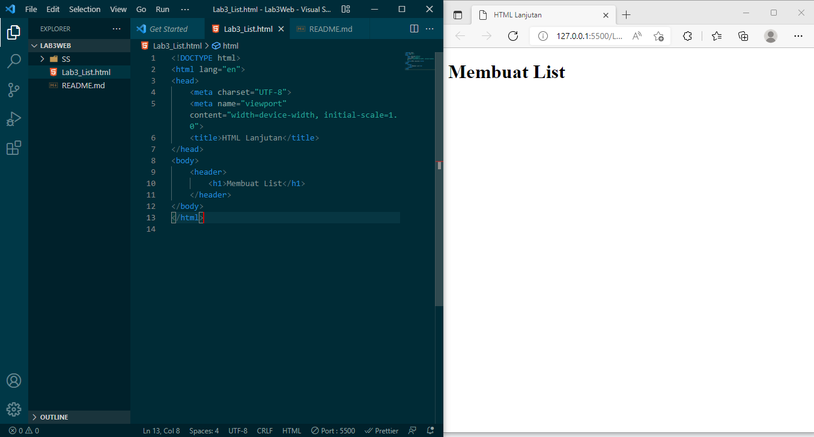
## Code
    <!DOCTYPE html>
    <html lang="en">
    <head>
        <meta charset="UTF-8">
        <meta name="viewport" content="width=device-width, initial-scale=1.0">
        <title>HTML Lanjutan</title>
    </head>
    <body>
        <header>
            <h1>Membuat List</h1>
        </header>
    </body>
    </html>
## Membuat Ordered List
Setelah Saya Menambahkan kode untuk membuat Ordered List Hasilnya seperti berikut.
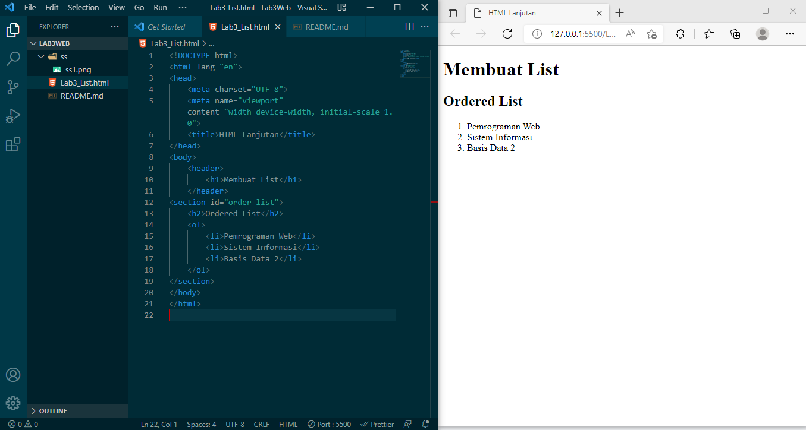
## Kode
    <section id="order-list">
        <h2>Ordered List</h2>
        <ol>
            <li>Pemrograman Web</li>
            <li>Sistem Informasi</li>
            <li>Basis Data 2</li>
        </ol
## Membuat Unorderd List
Setelah Saya Menambahkan kode untuk membuat Unorderd List Hasilnya seperti berikut.
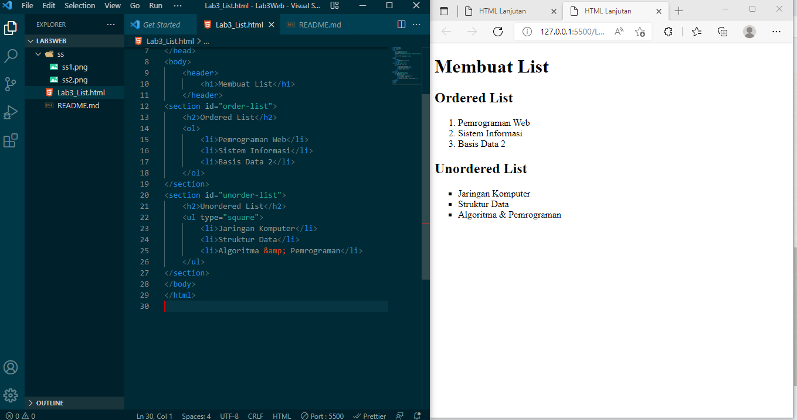
## Kode 
    <section id="unorder-list">
        <h2>Unordered List</h2>
        <ul type="square">
            <li>Jaringan Komputer</li>
            <li>Struktur Data</li>
            <li>Algoritma &amp; Pemrograman</li>
        </ul>
    </section>
## Membuat Description List
Setelah saya Menambahkan kode untuk membuat description list setelah deklarasi unorderd-list Hasilnya Seperti Berikut.
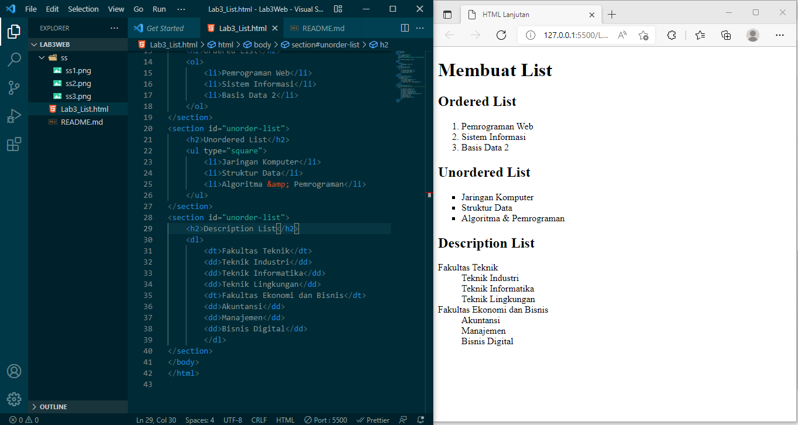
## Kode
    <section id="unorder-list">
        <h2>Description List</h2>
        <dl>
            <dt>Fakultas Teknik</dt>
            <dd>Teknik Industri</dd>
            <dd>Teknik Informatika</dd>
            <dd>Teknik Lingkungan</dd>
            <dt>Fakultas Ekonomi dan Bisnis</dt>
            <dd>Akuntansi</dd>
            <dd>Manajemen</dd>
            <dd>Bisnis Digital</dd>
            </dl>
    </section>
# 2). Langakh - Langkah Awal Membuat Table
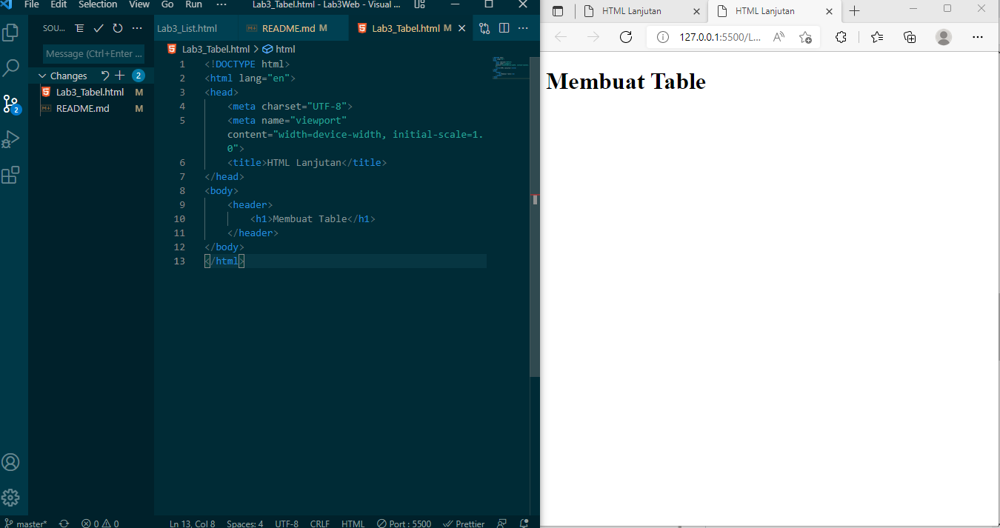
## Kode 
    <!DOCTYPE html>
    <html lang="en">
    <head>
        <meta charset="UTF-8">
        <meta name="viewport" content="width=device-width, initial-scale=1.0">
        <title>HTML Lanjutan</title>
    </head>
    <body>
        <header>
            <h1>Membuat Table</h1>
        </header>
    </body>
    </html>
## Mengatur Margin dan Padding
Untuk mengatur margin dan padding pada cel data, Saya menambahkan atribut cellpadding dan
cellspacing pada tag table.
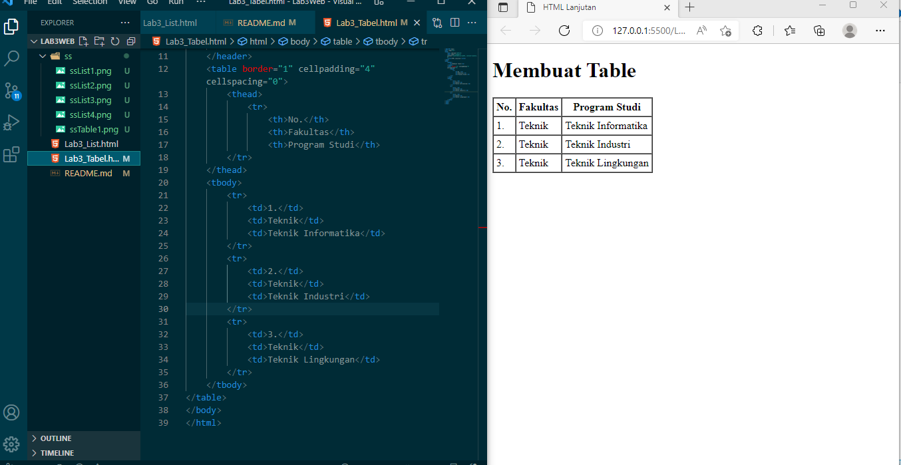
## Code
    <table border="1" cellpadding="4" cellspacing="0">
            <thead>
                <tr>
                    <th>No.</th>
                    <th>Fakultas</th>
                    <th>Program Studi</th>
            </tr>
        </thead>
        <tbody>
            <tr>
                <td>1.</td>
                <td>Teknik</td>
                <td>Teknik Informatika</td>
            </tr>
            <tr>
                <td>2.</td>
                <td>Teknik</td>
                <td>Teknik Industri</td>
            </tr>
            <tr>
                <td>3.</td>
                <td>Teknik</td>
                <td>Teknik Lingkungan</td>
            </tr>
        </tbody>
    </table>
## Menggabungkan Sel Data
Untuk menggabungkan sel data, gunakan atribut rowspan dan colspan. Atribut rowspan untuk
menggabungkan baris (secara vertikal) dan colspan untuk menggabungkan kolom (secara
horizontal).
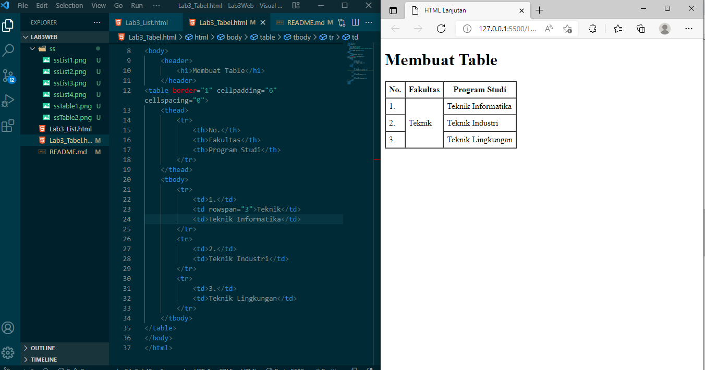
## Kode 
    <table border="1" cellpadding="6" cellspacing="0">
        <thead>
            <tr>
                <th>No.</th>
                <th>Fakultas</th>
                <th>Program Studi</th>
            </tr>
        </thead>
        <tbody>
            <tr>
                <td>1.</td>
                <td rowspan="3">Teknik</td>
                <td>Teknik Informatika</td>
            </tr>
            <tr>
                <td>2.</td>
                <td>Teknik Industri</td>
            </tr>
            <tr>
                <td>3.</td>
                <td>Teknik Lingkungan</td>
            </tr>
        </tbody>
    </table>
# 3). Langkah - Langkah Awal Membuat Form
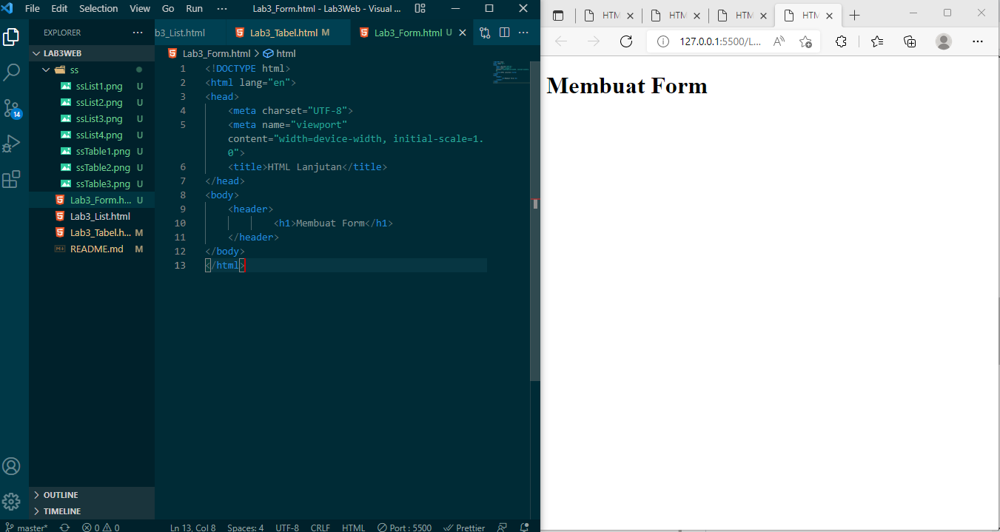
## kode 
    <!DOCTYPE html>
    <html lang="en">
    <head>
        <meta charset="UTF-8">
        <meta name="viewport" content="width=device-width, initial-scale=1.0">
        <title>HTML Lanjutan</title>
    </head>
    <body>
        <header>
                <h1>Membuat Form</h1>
        </header>
    </body>
    </html>
Selanjutnya Jadinya kaya Begini.
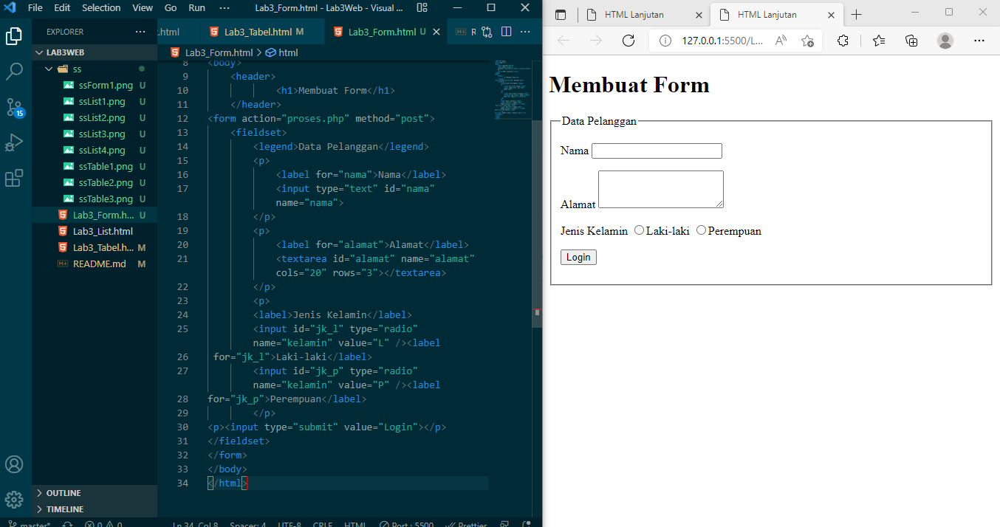
## Menabahkan Style pada Form
Agar tampilan form lebih menarik, bisa ditambahkan CSS seperti berikut.
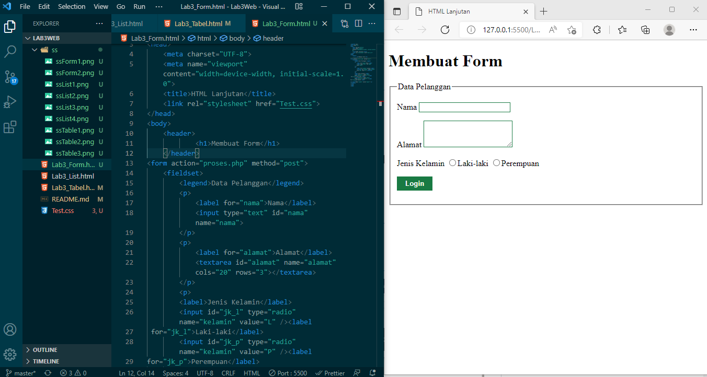
## Pertanyaan dan Tugas
1. Buatlah form yang menampilkan dropdown menu dan listbox dengan multiple selection.
## Jawaban Tugas 
Html
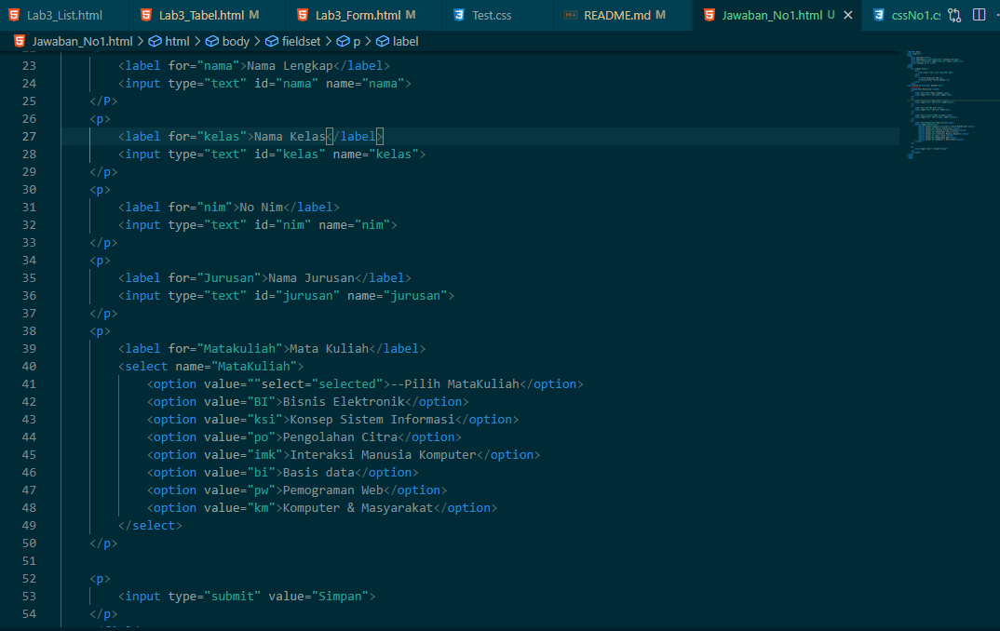
Css
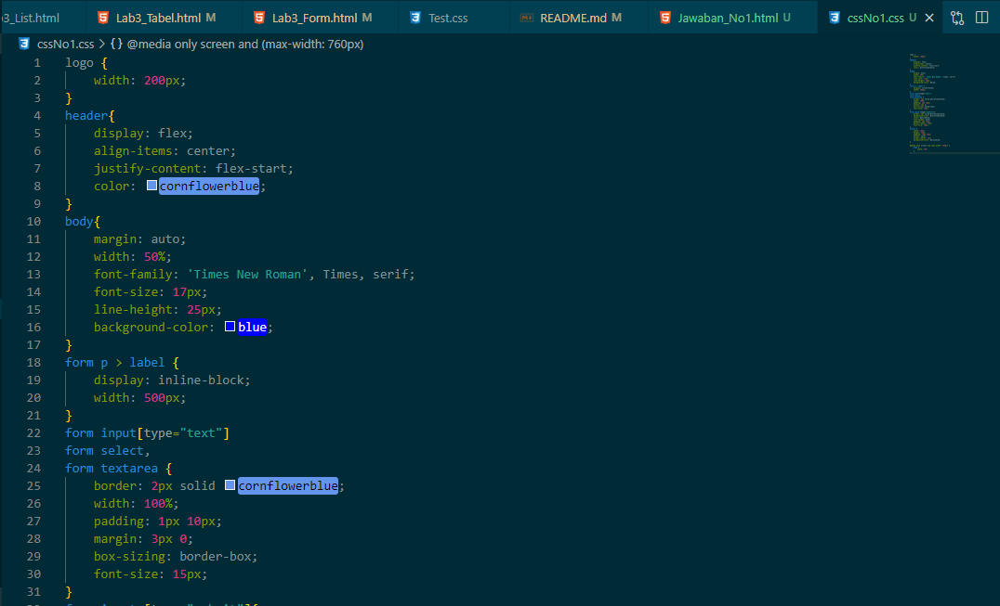
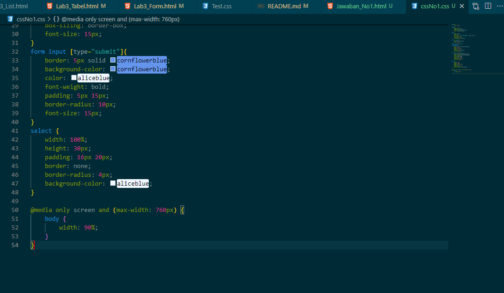
Hasilnya
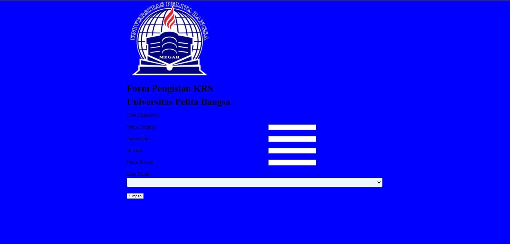