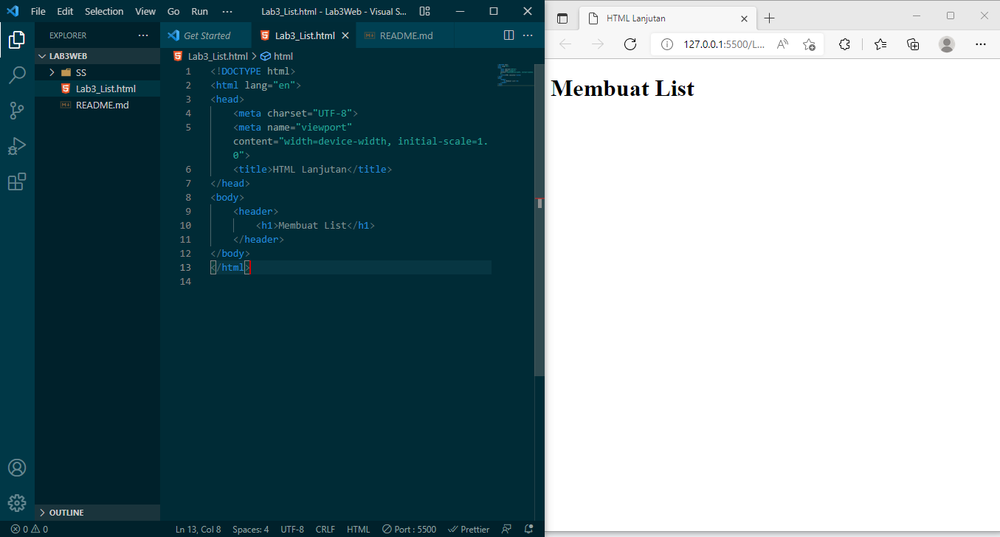
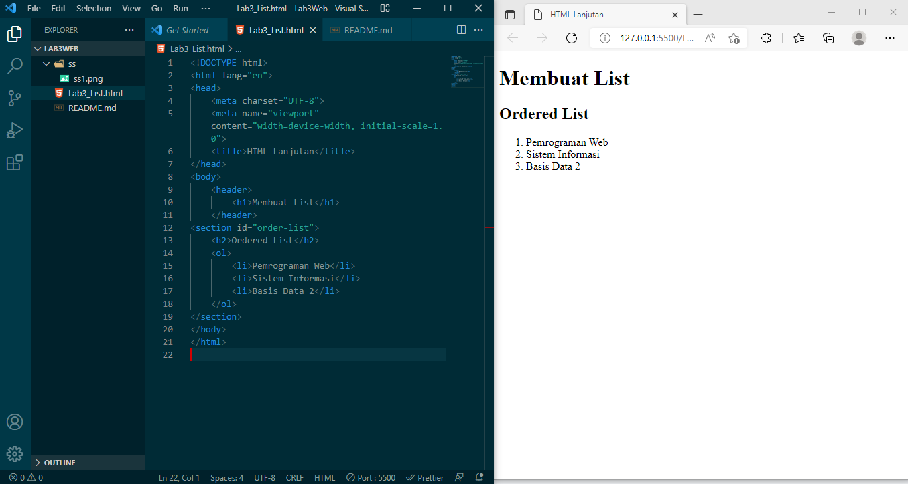
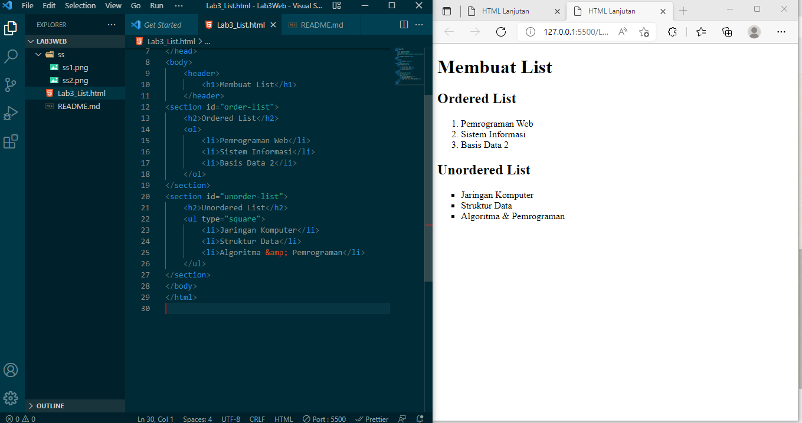
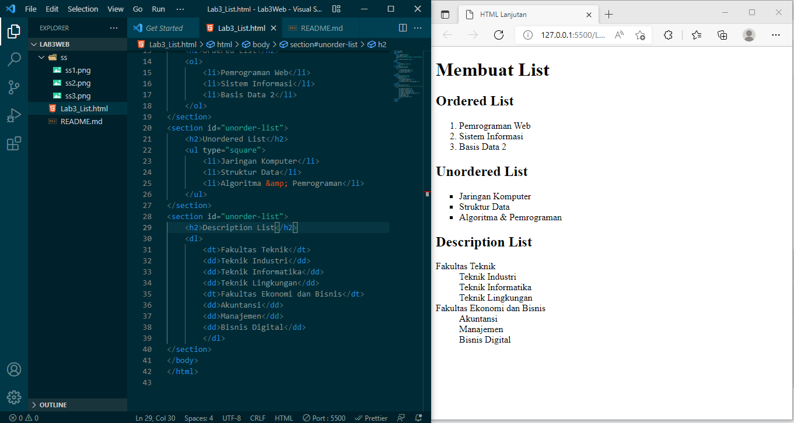

| Nama          | Sardin         |
|-------------- | ---------------|
| NIM           | 312010135      |
| Kelas         | TI.20.A1       |
| Matkul        | Pemograman web |

# Langkah - langkah Awal

# Code
    <!DOCTYPE html>
    <html lang="en">
    <head>
        <meta charset="UTF-8">
        <meta name="viewport" content="width=device-width, initial-scale=1.0">
        <title>HTML Lanjutan</title>
    </head>
    <body>
        <header>
            <h1>Membuat List</h1>
        </header>
    </body>
    </html>
# Membuat Ordered List
Setelah Saya Menambahkan kode untuk membuat Ordered List Hasilnya seperti berikut.

# Kode
    <section id="order-list">
        <h2>Ordered List</h2>
        <ol>
            <li>Pemrograman Web</li>
            <li>Sistem Informasi</li>
            <li>Basis Data 2</li>
        </ol
# Membuat Unorderd List
Setelah Saya Menambahkan kode untuk membuat Unorderd List Hasilnya seperti berikut.

# Kode 
    <section id="unorder-list">
        <h2>Unordered List</h2>
        <ul type="square">
            <li>Jaringan Komputer</li>
            <li>Struktur Data</li>
            <li>Algoritma &amp; Pemrograman</li>
        </ul>
    </section>
# Membuat Description List
Setelah saya Menambahkan kode untuk membuat description list setelah deklarasi unorderd-list Hasilnya Seperti Berikut.

# Kode
    <section id="unorder-list">
        <h2>Description List</h2>
        <dl>
            <dt>Fakultas Teknik</dt>
            <dd>Teknik Industri</dd>
            <dd>Teknik Informatika</dd>
            <dd>Teknik Lingkungan</dd>
            <dt>Fakultas Ekonomi dan Bisnis</dt>
            <dd>Akuntansi</dd>
            <dd>Manajemen</dd>
            <dd>Bisnis Digital</dd>
            </dl>
    </section>

